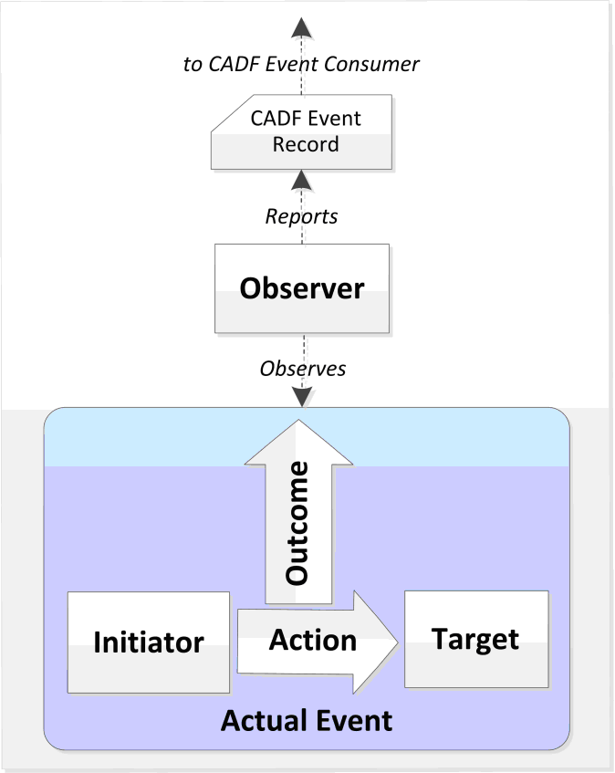
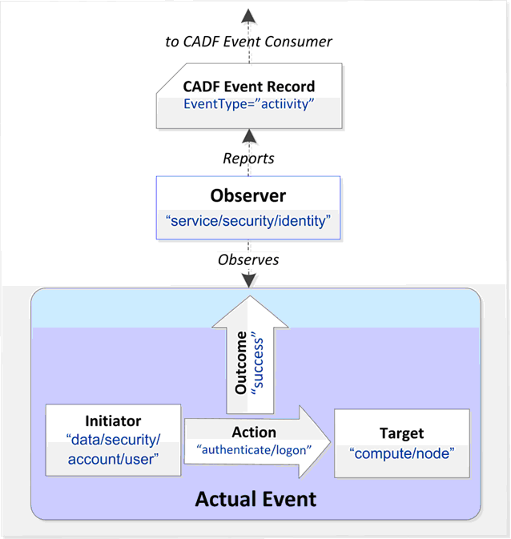
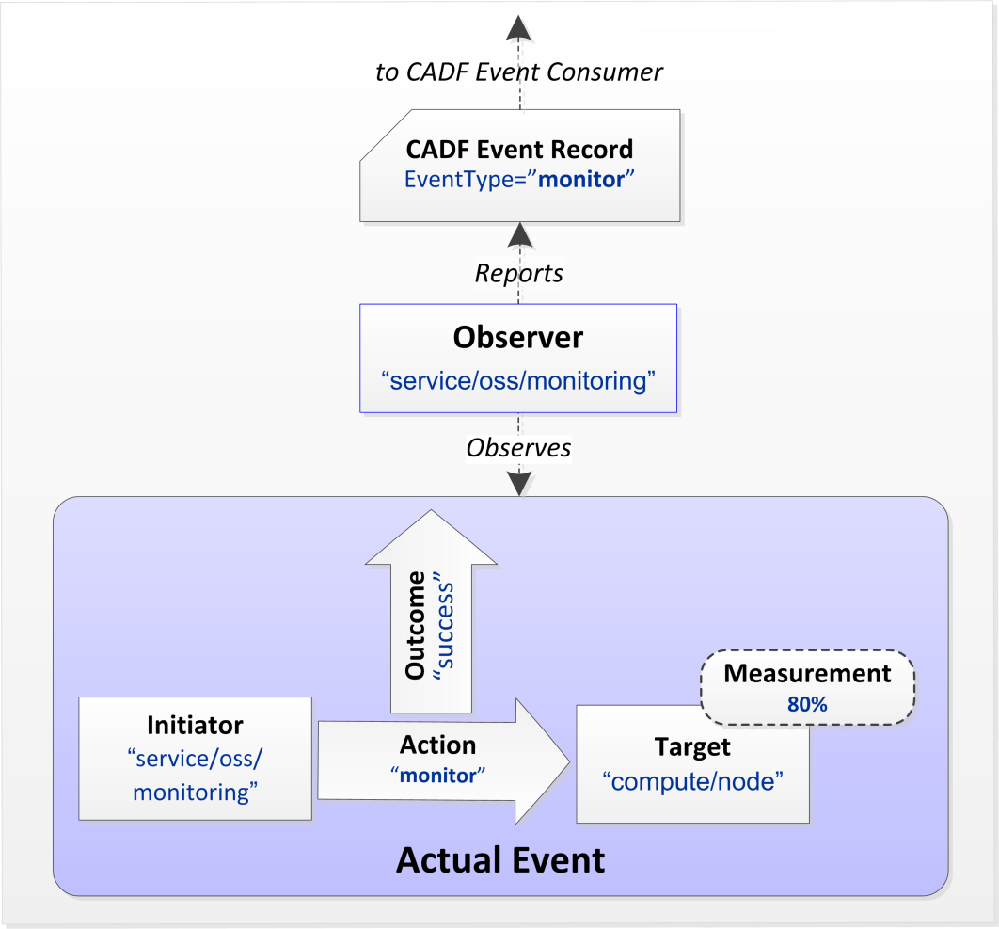

..
      Copyright 2014 IBM Corp.

      Licensed under the Apache License, Version 2.0 (the "License"); you may
      not use this file except in compliance with the License. You may obtain
      a copy of the License at

          http://www.apache.org/licenses/LICENSE-2.0

      Unless required by applicable law or agreed to in writing, software
      distributed under the License is distributed on an "AS IS" BASIS, WITHOUT
      WARRANTIES OR CONDITIONS OF ANY KIND, either express or implied. See the
      License for the specific language governing permissions and limitations
      under the License.

.. _event_concept:

=======
 Events
=======

The principal goal of this specification is to ensure that similar auditable
events, such as a "logon" or "critical resource update" resolve to the same
data format with prescriptive data types, entities, and properties to
facilitate reporting, query, federation, and aggregation.

Defining Events
===============

The event model is intended to describe the interactions between resources
that compose a cloud service. Conceptually, the event is based upon the
perspective of a single RESOURCE called the OBSERVER that is responsible for
observing the Actual Event and creating the (initial) CADF Event Record.

At a minimum, an Event must include the following attributes to be
CADF-compliant: eventType, observer, initiator, target, action, and outcome.
CADF's event model is extensible so any additional attributes that may better
help describe the event can be added to the event model as an additional
attribute.

.. note::

   In some cases, the OBSERVER, INITIATOR, and TARGET could reference the same
   resource. The precise interpretation of these components, therefore, will
   depend somewhat on the type of event being recorded, and the specific
   activity and resources involved.

Use Case Examples
=================

1. Auditing access to a controlled resource

Scenario: A cloud provider has a software component that manages identity and
access control that we will call an "identity management service". This
service is required, by the provider's security policy, to log all user
activities including "logon" attempts against any servers within the
provider's infrastructure.

================= ========================== ==========================================================================================
Event Attribute   Value                      Reason
================= ========================== ==========================================================================================
eventType         activity                   OBSERVER is required to report any user security activity
observer.typeURI  service/security/identity  Value from the CADF Resource Taxonomy most closely describes an "Identity Manager Service"
initiator.typeURI data/security/account/user Value from the CADF Resource Taxonomy most closely describes a "user"
action            authenticate/logon	     Value from the CADF Action Taxonomy most closely describes a user "logon" action.
target.typeURI    service/compute/node       Value from the CADF Resource Taxonomy most closely describes a target "server"
outcome           success                    Any valid CADF Outcome Taxonomy value that describes result of action
measurement       N/A                        A MEASUREMENT component is not required for "activity" type events.
REASON            N/A                        A REASON component is not required for "activity" type events.
================= ========================== ==========================================================================================

Event serialisation (including some optional attributes for additional
details)::

   {
    "typeURI": "http://schemas.dmtf.org/cloud/audit/1.0/event",
    "eventTime": "2014-02-27T19:29:30.855665+0000",
    "target": {
       "typeURI": "service/compute/node",
       # optional Endpoints to describe compute node
      "addresses": [{"url": "http://9.26.26.250:8774/v2/e7e2bcc9c0df4f3eabcd412ae62503f6", "name": "admin"},
                     {"url": "http://9.26.26.250:8774/v2/e7e2bcc9c0df4f3eabcd412ae62503f6", "name": "private"},
                     {"url": "http://9.26.26.250:8774/v2/e7e2bcc9c0df4f3eabcd412ae62503f6", "name": "public"}],
       "id": "openstack:06747855d62547d4bfd707f75b8a1c54",
       "name": "nova"},
    "observer": {"id": "target"}, # shortform to show Observer Resource is the same as Target
    # tags use to query events on
    "tags": ["correlation_id?value=openstack:56cdde6f-6b4e-48a4-94e6-defb40522fb2"],
    "eventType": "activity",
    "initiator": {
       "typeURI": "data/security/account/user",
       "name": "admin",
       # optional Credential to describe resource
       "credential": {"token": "MIIQzgYJKoZIhvcNAQcCoIIQvzCCELsC xxxxxxxx zqvD9OPWZm7VQpYNK2EvrZi-mTvb5A==",
                      "identity_status": "Confirmed"},
       # optional Host to describe resource
      "host": {"agent": "python-novaclient", "address": "9.26.26.250"},
      "project_id": "openstack:e7e2bcc9c0df4f3eabcd412ae62503f6",
      "id": "openstack:68a3f50705a54f799ce94380fc02ed8a"},
    # optional Reason for activity event
    "reason": {"reasonCode": "200", "reasonType": "HTTP"},
    # list of Resources which edited event
    "reporterchain": [{"reporterTime": "2014-02-27T19:29:31.043902+0000",
                       "role": "modifier",
                       "reporter": {"id": "target"}}],
    "action": "authenticate/logon",
    "outcome": "success",
    "id": "openstack:0a196053-95de-48f8-9890-4527b25b5007",
    # Event model is extensible so additional attributes may be added to describe model
    "requestPath": "/v2/e7e2bcc9c0df4f3eabcd412ae62503f6/os-certificates"}

2. Periodic monitoring resource status

Scenario: A cloud provider has software monitoring agents(Ceilometer)
installed on every server(Nova) that it makes available as an IaaS resource
to its customers. These agents are required to provide periodic informational
status of each server's CPU utilisation along with metric data to their
operations management software by using the CADF Event Record format.

================= ====================== ==========================================================================================
Event Attribute   Value                  Reason
================= ====================== ==========================================================================================
eventType         monitor                OBSERVER is required to monitor a server's CPU utilization
observer.typeURI  service/oss/monitoring Value from the CADF Resource Taxonomy most closely describes a "software monitoring agent"
initiator.typeURI service/oss/monitoring OBSERVER is also the INITIATOR of this monitoring event
action            monitor                Value from the CADF Action Taxonomy
target.typeURI    service/compute/cpu    Value from the CADF Resource Taxonomy most closely describes a server’s "cpu"
outcome           success                OBSERVER successfully obtained and reported a CPU utilization measurement
measurement       80%                    MEASUREMENT component is required and the observed value is 80% CPU utilisation
reason            N/A                    REASON component is not required for "monitor" type events.
================= ====================== ==========================================================================================

Event serialisation::

   {
    "typeURI": "http://schemas.dmtf.org/cloud/audit/1.0/event",
    "eventTime": "2014-02-27T19:29:30.855665+0000",
    "target": {
       "typeURI": "service/compute/cpu",
       "id": "openstack:06747855d62547d4bfd707f75b8a1c54",
       "name": "instance"},
    "observer": {"id": "initiator"},
    "eventType": "monitor",
    "initiator": {
       "typeURI": "service/oss/monitoring",
       "name": "ceilometer-pollster",
       "id": "openstack:68a3f50705a54f799ce94380fc02ed8a"},
    "measurement": [{
       "result": "80",
       "metric": {"metricId": "openstack:<metric_id>",
                  "unit": "%",
                  "name": "CPU utilisation metric"}
    }]
    "action": "monitor",
    "outcome": "success",
    "id": "openstack:0a196053-95de-48f8-9890-4527b25b5007"}

.. note::

   Additional use cases can be found in the Full CADF specification.